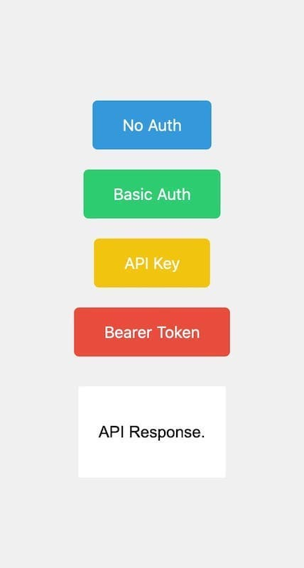

# <a href="https://www.udemy.com/course/the-complete-web-development-bootcamp" target="_blank">Udemy tutorial</a>

## The Complete Web Development Bootcamp

> by Dr. Angela Yu
### Chapter 5.4 : API Authentication



<a href="https://secrets-api.appbrewery.com/" target="_blank">Secret_API_Documentation</a>

Welcome to the Secrets API. This API allows you to manage and retrieve secrets anonymously. Please refer to the documentation below for details on how to interact with the API.
The API is rate limited to 100 requests every 15 minutes.
All user submitted data (including registration, tokens, usernames, passwords, secrets) are erased on a regular basis.
This API is just for education purposes, please don't rely on it for production.
Authentication

Basic Authentication is required for some endpoints. Use your username and password to authenticate.
An API Key is requred to Authorize certain endpoints. Use the API key obtained from the /generate-api-key endpoint.
Bearer Token Authentication is required for some endpoints. Use your username and password to get a token obtained from the /get-auth-token endpoint.

---
Instructions :

1. fork this repo

2. update local project :
```
npm i
```
3. run server :
```
nodemon solution.js
```
4. launch the web page in default browser :
```
open http://localhost:3000
```

---
The first step is to send an authentication request via **"Postman "** to the external API:
```
POST https://secrets-api.appbrewery.com/register
```
still via **"Postman "** go to the **"Body "** tab and choose the **"x-www-form-urlencoded "** format, add 2 lines (**"Key "** : "username" and "password" and fill in the **"Value "** column with the "name" and "password" of your choice) + click on **"Send "**.

A status of 200 means that all has gone well and that it's successfully registered.

Keep your username and password, as we'll need them later.

---
Links :

-   <a href="https://ipopop.github.io/U2Me_Complete_Web_Development_Bootcamp_5-4_API_Authentication/" target="_blank">Secret_API_Documentation (local link)</a>

- <a href="./video_transcript.md" target="_blank">Video_Transcription (in french)</a>

- <a href="https://www.appbrewery.co/p/web-development-course-resources" target="_blank">Web-Development-Course-Resources</a> (and search the "Section 20: APIs - Application Programming Interfaces")

---
Tools : 

- <a href="https://www.postman.com/downloads/" target="_blank">Postman (download)</a>